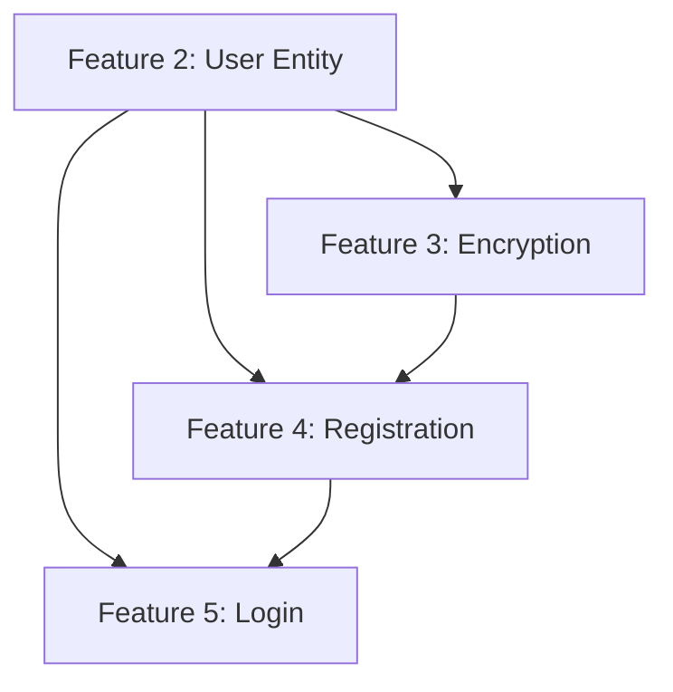

# 📚 Rev-PasswordManager Feature Documentation

This document provides comprehensive documentation for Features 2-5 of the Rev-PasswordManager application. Each section explains the feature purpose, file breakdown, important code snippets, and functionality.

---

## 📁 Feature Folder Structure

```
Feature/
├── Feature 2/Feature 2/      # User Entity & Repository
├── Feature 3/Feature 3/      # Encryption Service
├── Feature 4/Feature 4/      # User Registration
└── feature 5/feature 5/      # User Login (Authentication)
```

---

# 🔵 Feature 2: User Entity & Repository

## Overview
Creates the core User entity and repository that all authentication and vault features depend on. This is the foundation layer that other features build upon.

## Files

### 1. `User.java`
**Location:** `model/user/`  
**Purpose:** JPA Entity class representing a user in the database

| Field | Type | Description |
|-------|------|-------------|
| `id` | Long | Primary key (auto-generated) |
| `email` | String | Unique email address |
| `username` | String | Unique username |
| `masterPasswordHash` | String | BCrypt hash of master password |
| `salt` | String | Unique salt for encryption |
| `is2faEnabled` | boolean | Two-factor auth flag |
| `createdAt` | LocalDateTime | Account creation timestamp |
| `updatedAt` | LocalDateTime | Last update timestamp |
| `deletionRequestedAt` | LocalDateTime | When deletion was requested |
| `deletionScheduledAt` | LocalDateTime | When account will be deleted |

**Key Code:**
```java
@Entity
@Table(name = "users")
@Data
@Builder
@NoArgsConstructor
@AllArgsConstructor
public class User {
    @Id
    @GeneratedValue(strategy = GenerationType.IDENTITY)
    private Long id;

    @Column(nullable = false, unique = true)
    private String email;

    @Column(name = "master_password_hash", nullable = false)
    private String masterPasswordHash;

    @Column(nullable = false)
    private String salt; // Unique salt for this user's encryption
}
```

---

### 2. `UserRepository.java`
**Location:** `repository/`  
**Purpose:** Spring Data JPA repository for User database operations

**Key Methods:**
| Method | Return Type | Purpose |
|--------|-------------|---------|
| `findByUsername(String)` | `Optional<User>` | Find user by username |
| `findByEmail(String)` | `Optional<User>` | Find user by email |
| `existsByUsername(String)` | `boolean` | Check username exists |
| `existsByEmail(String)` | `boolean` | Check email exists |
| `findByDeletionScheduledAtBefore(LocalDateTime)` | `List<User>` | Find accounts scheduled for deletion |

**Key Code:**
```java
@Repository
public interface UserRepository extends JpaRepository<User, Long> {
    Optional<User> findByUsername(String username);
    Optional<User> findByEmail(String email);
    boolean existsByUsername(String username);
    boolean existsByEmail(String email);
    List<User> findByDeletionScheduledAtBefore(LocalDateTime dateTime);
}
```

---

### 3. `UserResponse.java`
**Location:** `dto/response/`  
**Purpose:** Safe DTO for returning user data (excludes sensitive fields like password hash)

**Fields:**
- `id`, `email`, `username`, `is2faEnabled`, `createdAt`

> [!IMPORTANT]
> This DTO **never** includes the password hash or salt for security reasons.

---

### 4. `SecurityConfig.java`
**Location:** `config/`  
**Purpose:** Spring Security configuration with JWT filter chain

**Key Functionality:**
- Disables CSRF (stateless API)
- Configures stateless session management
- Permits public endpoints: `/api/auth/**`, `/api/health/**`, Swagger docs
- Requires authentication for all other endpoints
- Uses BCrypt password encoder

**Key Code:**
```java
@Bean
public SecurityFilterChain securityFilterChain(HttpSecurity http) throws Exception {
    http
        .csrf(AbstractHttpConfigurer::disable)
        .sessionManagement(session -> session.sessionCreationPolicy(SessionCreationPolicy.STATELESS))
        .authorizeHttpRequests(auth -> auth
            .requestMatchers("/api/auth/**", "/api/health/**", "/swagger-ui/**").permitAll()
            .anyRequest().authenticated())
        .addFilterBefore(jwtAuthFilter, UsernamePasswordAuthenticationFilter.class);
    return http.build();
}
```

---

# 🟢 Feature 3: Encryption Service

## Overview
Core encryption/decryption service using **AES-256-GCM**. This is required before any vault password can be stored securely.

## Files

### 1. `EncryptionService.java`
**Location:** `service/security/`  
**Purpose:** Service layer for encryption operations

**Key Methods:**
| Method | Purpose |
|--------|---------|
| `encrypt(String, SecretKey)` | Encrypt data with given key |
| `decrypt(String, SecretKey)` | Decrypt data with given key |
| `generateNewKey()` | Generate new AES-256 key |
| `encodeKey(SecretKey)` | Encode key to Base64 for storage |
| `decodeKey(String)` | Decode Base64 string back to key |

**Key Code:**
```java
@Service
public class EncryptionService {
    private final EncryptionUtil encryptionUtil;

    public String encrypt(String data, SecretKey key) {
        try {
            return encryptionUtil.encrypt(data, key);
        } catch (Exception e) {
            throw new RuntimeException("Error occurred while encrypting data", e);
        }
    }
}
```

---

### 2. `EncryptionUtil.java`
**Location:** `util/`  
**Purpose:** Low-level AES-256-GCM encryption implementation

**Technical Details:**
- **Algorithm:** AES-256-GCM (Galois/Counter Mode)
- **IV Length:** 12 bytes
- **Tag Length:** 128 bits
- **Output:** Base64 encoded (IV + Ciphertext)

**Key Code:**
```java
public String encrypt(String data, SecretKey key) throws Exception {
    byte[] iv = new byte[GCM_IV_LENGTH];
    new SecureRandom().nextBytes(iv);

    Cipher cipher = Cipher.getInstance(encryptionConfig.getAlgorithm());
    GCMParameterSpec parameterSpec = new GCMParameterSpec(GCM_TAG_LENGTH, iv);
    cipher.init(Cipher.ENCRYPT_MODE, key, parameterSpec);

    byte[] cipherText = cipher.doFinal(data.getBytes(StandardCharsets.UTF_8));

    // Combine IV and CipherText
    byte[] encryptedData = new byte[GCM_IV_LENGTH + cipherText.length];
    System.arraycopy(iv, 0, encryptedData, 0, GCM_IV_LENGTH);
    System.arraycopy(cipherText, 0, encryptedData, GCM_IV_LENGTH, cipherText.length);

    return Base64.getEncoder().encodeToString(encryptedData);
}
```

> [!TIP]
> GCM mode provides both encryption and authentication (integrity checking), making it more secure than CBC mode.

---

### 3. `MasterPasswordValidator.java`
**Location:** `security/`  
**Purpose:** Validates master password strength

**Password Requirements:**
- ✅ Minimum 12 characters
- ✅ At least 1 uppercase letter
- ✅ At least 1 lowercase letter
- ✅ At least 1 digit
- ✅ At least 1 special character (`@#$%^&+=!`)
- ✅ No whitespace

**Regex Pattern:**
```java
private static final String PASSWORD_PATTERN = 
    "^(?=.*[0-9])(?=.*[a-z])(?=.*[A-Z])(?=.*[@#$%^&+=!])(?=\\S+$).{12,}$";
```

---

# 🟡 Feature 4: User Registration

## Overview
New users create accounts with email, username, and master password. The password is hashed with a unique salt before storage.

## Files

### 1. `RegistrationService.java`
**Location:** `service/auth/`  
**Purpose:** Handles registration business logic

**Registration Flow:**
```
1. Check if email exists → throw AuthenticationException if true
2. Check if username exists → throw AuthenticationException if true
3. Validate master password strength → throw if weak
4. Generate unique salt (UUID)
5. Hash password with BCrypt
6. Save user to database
7. Return UserResponse DTO
```

**Key Code:**
```java
@Transactional
public UserResponse registerUser(RegistrationRequest request) {
    // Duplicate checks
    if (userRepository.existsByEmail(request.getEmail())) {
        throw new AuthenticationException("Email is already in use");
    }

    // Password validation
    if (!masterPasswordValidator.isValid(request.getMasterPassword())) {
        throw new AuthenticationException("Weak master password");
    }

    // Generate salt and create user
    String salt = UUID.randomUUID().toString();
    User newUser = User.builder()
        .email(request.getEmail())
        .username(request.getUsername())
        .masterPasswordHash(passwordEncoder.encode(request.getMasterPassword()))
        .salt(salt)
        .build();

    User savedUser = userRepository.save(newUser);
    return UserResponse.builder()...build();
}
```

---

### 2. `RegistrationRequest.java`
**Location:** `dto/request/`  
**Purpose:** DTO for registration input with validation

**Validation Rules:**
| Field | Constraint |
|-------|------------|
| `email` | Required, valid email format |
| `username` | Required, 3-50 characters |
| `masterPassword` | Required |

---

### 3. `AuthController.java`
**Location:** `controller/`  
**Purpose:** REST controller for authentication endpoints

**Endpoints:**
| Method | Endpoint | Description |
|--------|----------|-------------|
| POST | `/api/auth/register` | Register new user |
| POST | `/api/auth/login` | Login and get JWT tokens |

---

### 4. `UserController.java`
**Location:** `controller/`  
**Purpose:** User account management endpoints

**Endpoints:**
| Method | Endpoint | Description |
|--------|----------|-------------|
| DELETE | `/api/users/account` | Schedule account deletion (30-day grace period) |
| POST | `/api/users/account/cancel-deletion` | Cancel pending deletion |

> [!WARNING]
> Account deletion is scheduled for 30 days in the future, allowing users to cancel if needed.

---

# 🔴 Feature 5: User Login (Authentication)

## Overview
Users authenticate with username/email and master password. The system generates JWT access and refresh tokens for subsequent API calls.

## Files

### 1. `AuthenticationService.java`
**Location:** `service/auth/`  
**Purpose:** Handles login logic and token generation

**Login Flow:**
```
1. Authenticate with Spring Security's AuthenticationManager
2. Load user from database (by username or email)
3. Generate access token (short-lived)
4. Generate refresh token (long-lived)
5. Return AuthResponse with tokens and user info
```

**Key Code:**
```java
public AuthResponse login(LoginRequest request) {
    Authentication authentication = authenticationManager.authenticate(
        new UsernamePasswordAuthenticationToken(
            request.getUsername(),
            request.getMasterPassword()));

    User user = userRepository.findByUsername(request.getUsername())
        .or(() -> userRepository.findByEmail(request.getUsername()))
        .orElseThrow(() -> new AuthenticationException("User not found"));

    String accessToken = jwtTokenProvider.generateAccessToken(authentication);
    String refreshToken = jwtTokenProvider.generateRefreshToken(authentication);

    return AuthResponse.builder()
        .accessToken(accessToken)
        .refreshToken(refreshToken)
        .user(userResponse)
        .build();
}
```

---

### 2. `JwtTokenProvider.java`
**Location:** `security/`  
**Purpose:** JWT token generation and validation

**Key Methods:**
| Method | Purpose |
|--------|---------|
| `generateAccessToken(Authentication)` | Create short-lived access token |
| `generateRefreshToken(Authentication)` | Create long-lived refresh token |
| `getUsernameFromToken(String)` | Extract username from token |
| `validateToken(String)` | Validate token signature and expiry |

**Token Generation:**
```java
private String generateToken(Map<String, Object> extraClaims, UserDetails userDetails, long expiration) {
    return Jwts.builder()
        .claims(extraClaims)
        .subject(userDetails.getUsername())
        .issuedAt(new Date(System.currentTimeMillis()))
        .expiration(new Date(System.currentTimeMillis() + expiration))
        .signWith(getSignInKey())
        .compact();
}
```

---

### 3. `JwtAuthenticationFilter.java`
**Location:** `security/`  
**Purpose:** Filter that validates JWT on every request

**Filter Flow:**
```
1. Extract "Authorization" header
2. Check if it starts with "Bearer "
3. Extract and validate JWT token
4. If valid, extract username and load UserDetails
5. Set authentication in SecurityContext
6. Continue filter chain
```

**Key Code:**
```java
protected void doFilterInternal(HttpServletRequest request, HttpServletResponse response, 
                                 FilterChain filterChain) {
    final String authHeader = request.getHeader("Authorization");
    
    if (authHeader == null || !authHeader.startsWith("Bearer ")) {
        filterChain.doFilter(request, response);
        return;
    }

    jwt = authHeader.substring(7);
    if (jwtTokenProvider.validateToken(jwt)) {
        username = jwtTokenProvider.getUsernameFromToken(jwt);
        // Set authentication...
    }
    filterChain.doFilter(request, response);
}
```

---

### 4. `CustomUserDetailsService.java`
**Location:** `security/`  
**Purpose:** Loads user for Spring Security authentication

**Key Feature:** Supports login by **username OR email**

```java
public UserDetails loadUserByUsername(String username) {
    User user = userRepository.findByUsername(username)
        .or(() -> userRepository.findByEmail(username))
        .orElseThrow(() -> new UsernameNotFoundException("User not found"));

    return new org.springframework.security.core.userdetails.User(
        user.getUsername(),
        user.getMasterPasswordHash(),
        new ArrayList<>()); // No roles yet
}
```

---

### 5. `LoginRequest.java`
**Location:** `dto/request/`  
**Purpose:** DTO for login credentials

**Fields:**
- `username` (required) - Can be username or email
- `masterPassword` (required)

---

### 6. `AuthResponse.java`
**Location:** `dto/response/`  
**Purpose:** Response containing authentication tokens

**Fields:**
| Field | Description |
|-------|-------------|
| `accessToken` | Short-lived JWT for API access |
| `refreshToken` | Long-lived token for obtaining new access tokens |
| `tokenType` | Always "Bearer" |
| `user` | UserResponse with user details |

---

# 📊 Feature Summary Table

| Feature | Purpose | Files | Key Technology |
|---------|---------|-------|----------------|
| **Feature 2** | User Entity & Repository | 4 | JPA, Spring Data |
| **Feature 3** | Encryption Service | 3 | AES-256-GCM |
| **Feature 4** | User Registration | 4 | BCrypt, Validation |
| **Feature 5** | User Login | 8 | JWT, Spring Security |

---

# 🔗 Feature Dependencies



---

# 🎯 API Endpoints Summary

| Endpoint | Method | Feature | Auth Required |
|----------|--------|---------|---------------|
| `/api/auth/register` | POST | Feature 4 | ❌ |
| `/api/auth/login` | POST | Feature 5 | ❌ |
| `/api/users/account` | DELETE | Feature 4 | ✅ |
| `/api/users/account/cancel-deletion` | POST | Feature 4 | ✅ |

---

> [!NOTE]
> This documentation covers Features 2-5 which form the **Foundation** and **Authentication** phases of the application as defined in the Feature Development Guide.
