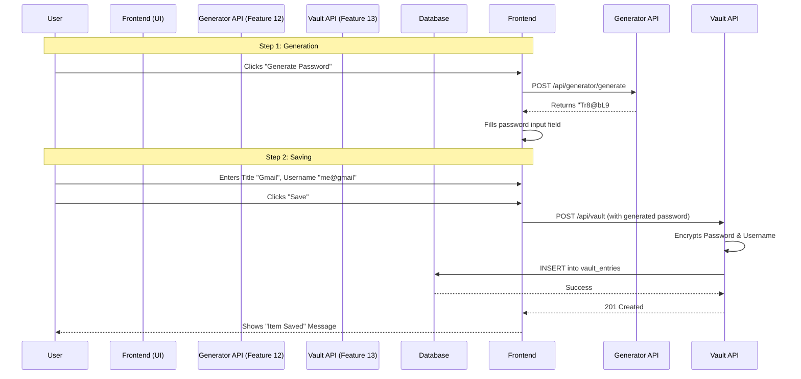

# 🔄 Password Generation & Vault Storage Flow

This document outlines how the **Password Generator (Feature 12)** and **Vault Items (Feature 13)** work together to allow a user to generate a secure password and immediately save it.

## The Concept
The "Generation" and "Storage" are distinct steps decoupled in the backend. The Frontend (UI) bridges them.
1.  **Frontend** asks Backend to **Generate** a password.
2.  **Backend** returns a random strong password.
3.  **Frontend** populates the "Password" input field with this value.
4.  **Frontend** sends the final form data (including the generated password) to the Backend to **Save** it in the Vault.

## API Sequence

### Step 1: Generate Password
**User Action**: Clicks "Generate Password" icon in the UI.
**API Call**: `POST /api/generator/generate`

**Request:**
```json
{
  "length": 16,
  "includeUppercase": true,
  "includeNumbers": true,
  "includeSpecial": true
}
```

**Response:**
```json
{
  "password": "Tr8@bL9#mK2$pQ5v"
}
```
*UI Action*: The Frontend takes `"Tr8@bL9#mK2$pQ5v"` and fills the `<input type="password">` field in the "Add Item" form.

---

### Step 2: Save to Vault
**User Action**: User fills in "Title" (e.g., "Gmail") and "Username", then clicks "Save".
**API Call**: `POST /api/vault`

**Request:**
```json
{
  "title": "Gmail",
  "username": "my.email@gmail.com",
  "password": "Tr8@bL9#mK2$pQ5v",  <-- The generated password is sent here
  "websiteUrl": "https://gmail.com",
  "categoryId": 1
}
```

**Response:** `201 Created`
```json
{
  "id": 105,
  "title": "Gmail",
  "username": "******",
  "createdAt": "..."
}
```

## Visual Flow (Sequence Diagram)


